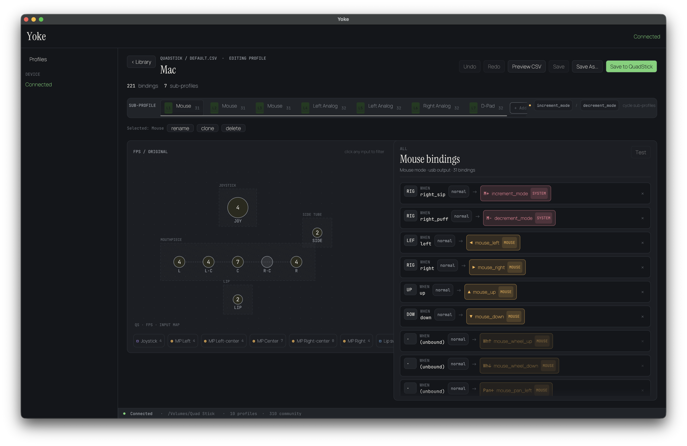

# Yoke

**Configuration software for the [QuadStick](https://www.quadstick.com/)** — a
sip-and-puff adaptive game controller for quadriplegic gamers. *Pilot your
computer, your way.*

macOS first; Windows planned. Configuration only — no firmware flashing.



## What it does

A QuadStick turns sips, puffs, lip pressure, and joystick motion into
keystrokes, mouse moves, and gamepad signals. Which input maps to which output
lives in CSV *profiles* the device stores on the FAT volume it exposes in
mass-storage mode. Yoke is how you read, build, and write those profiles —
without hand-editing CSV.

### Desktop app (`yoke-gui`)

- **Browse profiles** on your connected QuadStick alongside a curated community
  library.
- **Visual device map** — see the joystick, mouthpiece sip/puff zones, side
  tube, and lip sensor, each showing what it's bound to.
- **Interactive binding editor** — map any input to any output, with modifiers,
  output modes, and channels, all validated against the device's vocabulary.
- **Sub-profiles (layers)** — manage the layered modes a single profile can
  switch between.
- **Install community profiles** by name, URL, or local file.
- **Validate and preview** a profile's CSV before writing it back to the device.

### Command line (`yokectl`)

A scriptable surface over the same configuration model — list, inspect,
validate, edit, and install profiles, emit human or JSON output, and target a
real QuadStick volume or a filesystem-backed fake. See
[the `yokectl` reference](#yokectl-reference) below.

## Install

### macOS

Download the latest **`Yoke.dmg`** from the
[Releases](https://github.com/palicand/yoke/releases) page, open it, and drag
**Yoke** into your Applications folder. The app is signed and notarized by
Apple, so it opens normally — no Gatekeeper right-click workaround needed.

Requires **macOS 11 (Big Sur) or later**. The build is universal — it runs
natively on both Apple Silicon and Intel Macs.

> **Note.** Live device push isn't implemented yet. Yoke writes profiles to the
> QuadStick's USB mass-storage volume, which appears once the device's
> mass-storage interface is enabled.

### Windows

Planned — see the roadmap below.

## Status & roadmap

Yoke is **alpha**, and macOS-only for now.

- **Working today** — browsing, editing, validating, and installing profiles to
  the QuadStick's mass-storage volume; the full `yokectl` CLI.
- **Next** — live device push over HID/serial (configure without
  mass-storage mode); a **Windows** build.
- **Later (gated)** — firmware flashing, behind explicit safeguards, once the
  device protocol work is mature enough.

## yokectl reference

`yokectl` targets either a real QuadStick volume or a filesystem-backed fake
(`--fake-volume <dir>`) and emits human or JSON output via `--json`.

```sh
yokectl device                              # state of the attached volume
yokectl watch --json                        # stream mount events as NDJSON
yokectl list                                # profiles on the volume
yokectl show destiny                        # parsed view of one profile
yokectl validate ./local.csv                # parse + lint a local file
yokectl push ./local.csv destiny            # write a local file to the volume
yokectl pull destiny ./out.csv              # copy a volume profile out
yokectl install "Destiny 2"                 # fetch by community-index name
yokectl install https://docs.google.com/... # fetch by URL (CSV/Sheets)
yokectl install ./profile.csv               # install a local file
yokectl index list                          # browse the community index
yokectl add-binding destiny Main lip_soft kb_a       # add a binding (optional --modifier)
yokectl update-binding destiny Main lip_soft kb_a --modifier "delay_on 250"
yokectl clear-binding destiny Main lip_soft          # remove binding(s) for an input
yokectl apply ops.json                      # atomic batch edit
yokectl completions fish                    # shell completion script
yokectl docs --format md --out ./docs       # generate reference docs
yokectl topic install-sources               # in-binary topic page
```

`yokectl manual` opens the upstream QuadStick user manual in a browser;
`yokectl catalog` enumerates the inputs, outputs, preferences, modes, channels,
and modifiers the binder understands. `yokectl --help` lists every subcommand
and `yokectl <cmd> --help` documents flags. The `topic` pages
(`install-sources`, `binding-model`, `preferences`, `sip-puff`, `sub-profiles`)
cover the concepts the flags assume.

## Build from source

For contributors. End users should use the DMG above.

1. **macOS prerequisites:** install Xcode Command Line Tools — `xcode-select --install`.
2. **With Nix (quickest):** install Nix with flakes, then in this directory run
   `direnv allow`, then `cargo run -p yoke-gui` for the desktop app (or
   `cargo build -p yokectl` for the CLI).
3. **Without Nix:** install [rustup](https://rustup.rs/) (the toolchain is
   pinned by `rust-toolchain.toml`), then `cargo run -p yoke-gui`. For the
   in-browser dev build, `cargo install trunk` and run `trunk serve` inside
   `crates/yoke-gui/`.

To produce a release DMG, see [`docs/RELEASING.md`](docs/RELEASING.md). The full
contributor flow, repo map, and house rules live in [`AGENTS.md`](./AGENTS.md).

## Credits & license

Yoke is an **independent project**. It is **not affiliated with, sponsored by,
or endorsed by** the QuadStick or its creator. "QuadStick" refers to the
hardware; "Yoke" is this configuration software. The two coexist — they are not
the same thing.

Yoke would not exist without Fred Davidson and the QuadStick project. The
upstream Windows manager (QMP-4) is the authoritative reference for the device
wire protocol used here.

Yoke is MIT licensed — see [`LICENSE`](./LICENSE). Bundled fonts (Instrument
Serif, JetBrains Mono, Manrope) are licensed under the SIL Open Font License;
see [`crates/yoke-gui/assets/fonts/ATTRIBUTION.md`](crates/yoke-gui/assets/fonts/ATTRIBUTION.md).
